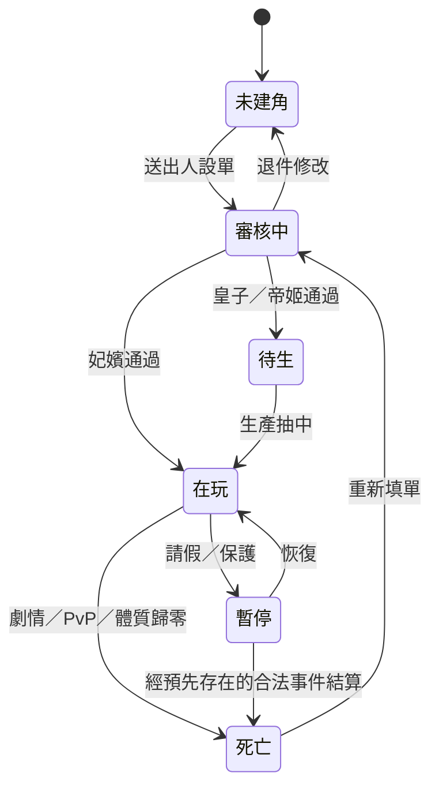
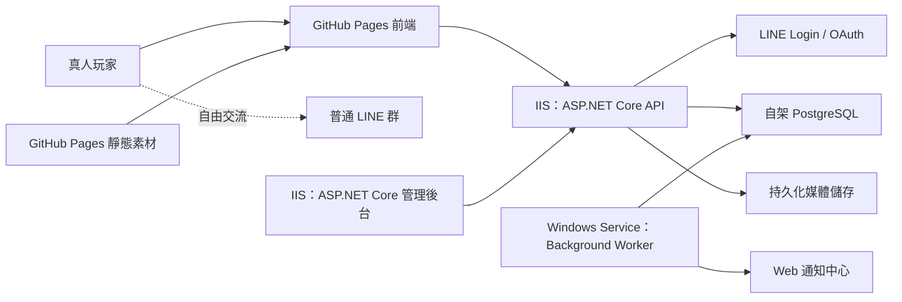

# 《暫名：宮闈浮生》遊戲企劃規格書

> 文件狀態：v1.0 玩法基準。開發規格已拆分為 [前端規格書_v1.0.md](./前端規格書_v1.0.md) 與最新版 [後端規格書_v1.0.md](./後端規格書_v1.0.md)。

> 文件版本：v1.0（GitHub Pages 前端原型定稿＋自架 ASP.NET Core／PostgreSQL 待實作）
> 文件日期：2026-08-16
> 原始素材：`C:\Users\max08\OneDrive\文件\Obsidian Vault\文遊` 內 41 份遊戲相關 Markdown
> 文件目的：將既有宮廷文字群規，整理並轉製為 Web-first 的多人 2D 人物文字遊戲；LINE 僅用於免費登入與玩家社群交流。

---

## 0. v1.0 功能異動總覽

### 0.1 本版新增／確認

- 玩家前台採 GitHub Pages React SPA，正式後端採 ASP.NET Core Web API＋PostgreSQL，管理後台採 ASP.NET Core MVC／Razor Pages on IIS。
- 頂部提供 LINE 登入與註冊入口；LINE Developers 已在 Provider「Max」建立「宮闈浮生」LINE Login Channel，Channel ID `2011123657`，目前為 Developing。
- 宮城輿圖依原始規則恢復六個核心地點，另加入宮市、內務府管理名單與宮中 NPC 名冊入口。
- 宮市收錄原始文件 41 項商品；人物頁新增宮市購入道具清單、數量、效果、購買時間與使用確認。
- 玩家名冊依最近上線排序並分頁，可查看玩家公開狀態、四能力標籤、今日及歷史歷程；事件亦可依地點與玩家篩選。
- 本人人物頁整合角色狀態、四能力級別、資源、今日／歷史歷程與持有道具；體質 570 的正式標籤為「康健」。
- 玩家可使用官方立繪或上傳自訂人物圖片送審；NPC 使用重新繪製的原創立繪，君疏鳶採自然成年女性形象，不刻意高齡化。
- 玩家可從內務府查看管理人員名單與分工；管理權限與實際後台功能不對玩家公開。
- Buy Me a Coffee 保留為右上外部支援入口，與任何遊戲利益完全脫鉤。

### 0.2 本版刪除／移出範圍

- 移除頂部全站搜尋，改放 LINE 登入與註冊按鈕。
- 移除玩家「人物關係」功能、關係圖與關係數值。
- 移除宮城輿圖的主線劇情節點；NPC 故事改由人物名冊閱讀。
- 從「宮務與藏冊」移除宮市與庫存卡片；宮市由地圖／人物頁進入，庫存整合於「我的人物」。
- 移除獨立庫存主畫面、每日 Action Point、LINE 群機器人必要流程及 GitHub Pages 正式管理後台。

### 0.3 目前尚未完成

- ASP.NET Core API、PostgreSQL、IIS、管理後台與所有正式交易／Audit 仍待實作；目前線上版本是可操作的前端原型。
- LINE Login Callback 尚未設定；待實際後端 HTTPS 網域完成後填入 `https://api.<正式網域>/api/v1/auth/line/callback`。Channel Secret 僅能保存在後端 Secret Store／環境變數。
- 自有網域的 `game`、`api`、`admin` 子網域、DNS、憑證、CORS、Cookie 與監控仍待完成。

---

## 1. 專案摘要

### 1.0 v1.0 產品決議

| 項目 | 正式決議 |
|---|---|
| 建角 | 宮妃：姓、名、小字、生辰、年齡 15～18、容貌、性格、擅、不擅、喜、不喜、自介；皇嗣姓蕭、年齡 0，另選帝姬／皇子。容貌至少 60 字，性格／擅／不擅／喜／不喜各 50 字，自介至少 200 字 |
| 圖片 | 可選官方預設立繪，也可上傳本人角色圖片；上傳圖需審核 |
| 初始值 | 銀兩、威望、恩寵皆 0；體質、容貌、心計、福氣由管理員核准的起始位號自動帶入，不可自由填值 |
| 位階 | 三類角色完整位號、威望／能力／活動門檻、名額及俸祿以 [rank_catalog_v1.0.md](./backend-spec/rank_catalog_v1.0.md) 為準 |
| 行動 | 不設每日 Action Point，玩家可不限次操作；個別玩法仍有截止、冷卻或自身次數限制 |
| 日曆 | 宮廷日曆以台北時區 1:1 推進，現實一日等於宮廷一日 |
| 投稿 | 可儲存草稿；Submit 後鎖定並等待管理員審核，Approved 才公開。其他玩家不看編輯紀錄 |
| 生育 | 無待生皇嗣時暫停侍寢；核准侍寢後受孕率預設 100%、可由後台設定；Pregnancy 預設 10 天、可設定；流產暫採事件觸發、不做每日隨機判定 |
| 管理調整 | 管理人員可直接調整銀兩及發放道具，不設雙人門檻；理由必填，操作者與前後值永久寫入可查的 Audit Log |
| 死亡重建 | 死亡即永久結束，玩家重新填單；新角無保護期、不繼承舊角。歷代角色連結只有管理員可看 |
| 保存 | Audit、事件正文與版本、死亡角色及死亡資料永久保存 |
| 贊助 | 網站右上顯示醒目 Buy Me a Coffee 按鈕，點擊開啟站內彈窗再前往外部頁；贊助不換取能力、銀兩、道具、位階或審核優待 |

### 1.1 遊戲概念

玩家使用 LINE Login 登入官方遊戲網站，建立一名妃嬪、皇子或帝姬角色，在虛構王朝「嘉城」年間共同生活。Web 遊戲承載 2D 人物、角色卡、每日行動、對戲提交、公告、通知、數值、宮市、抽籤、服儀、地圖與劇情選項，形成持續運作的多人宮廷世界。普通 LINE 群僅作玩家聊天、邀戲與管理員手動宣傳，不是遊戲規則或資料來源。

玩家透過不限次的 Web 行動、真人文字互動與宮廷事件，提升體質、心計、福氣、容貌與威望，建立盟友或敵人、爭取恩寵、孕育或扮演皇嗣並晉升位階。遊戲核心為「真人共演＋系統養成＋關係博弈＋2D 視覺化」。

### 1.2 類型與定位

- 類型：Web-first 多人宮廷文字角色扮演／社群養成／2D Web 遊戲
- 遊玩模式：真人多人、管理員營運、長期世界
- 玩家身分：妃嬪、皇子、帝姬皆可玩；皇帝與核心劇情 NPC 初期由系統或管理員控制
- 主要入口：手機與桌面瀏覽器的響應式 Web 遊戲
- 身分驗證：免費 LINE Login；不建置 Messaging API Bot、不依賴 LIFF／LINE MINI App
- 社群入口：既有普通 LINE 群，可由管理員手動張貼網站連結與重點公告
- 管理入口：ASP.NET Core MVC／Razor Pages 管理後台，部署於 IIS，支援桌面與平板
- 前端部署：GitHub Pages 靜態網站
- 後端部署：自架 ASP.NET Core Web API + Background Worker
- 資料庫：自架 PostgreSQL 17/18，不對公網開放
- 美術：2D 古風人物立繪、表情差分、靜態或輕動態背景
- 分級預期：涉及權謀、下毒、生育、流產與死亡，建議至少 15+；實際依發行平台審核
- 營運週期：一朝十二章；章節按排程解鎖，朝代完結後換代或開新服
- 商業模式：第一階段不設現金數值商城；提供不影響遊戲公平性的 Buy Me a Coffee 自願贊助連結

### 1.3 核心體驗支柱

1. **步步晉位**：從低階妃嬪累積威望與能力，取得更高位階、服儀、居所及權限。
2. **真人共演**：角色間的交情、聯盟、衝突與對戲主要由真人創造，系統保存結果與重要關係。
3. **宮中度日**：每天只能進行有限系統行動，需在養成、社交、侍奉、調查與自保之間取捨。
4. **命數浮沉**：福氣及體質影響事件、生育與危機，但重要結果仍可透過準備與選擇改變。
5. **一朝一世**：十二章構成完整朝代主線，玩家的位階、盟友、皇嗣與關鍵抉擇共同決定結局。

---

## 2. 原始素材轉製原則

原始文件屬人工管理的多人文字群規，其中部分制度不能直接套用至系統化多人遊戲。轉製原則如下：

| 原始群規 | 電子遊戲化方案（草案） |
|---|---|
| 每週訊息數、對戲字數 | 改為章節活躍度、已完成事件或主線貢獻度 |
| 管理員點名侍寢／侍膳 | 由帝王好感、關注度、位階及事件權重決定 |
| 管理員人工抽籤 | 由可顯示影響因子的隨機判定執行 |
| 玩家互相下毒 | 保留真人對抗，但由系統驗證道具、成功率、解毒時間與證據，避免私下爭議 |
| 寫 300～500 字自戲 | 保留自戲／對戲；由系統建立投稿、關聯事件、字數及人工審核紀錄 |
| 邀人、迎新、恭喜 | 可保留社群任務，但邀人獎勵須防分身與洗獎勵 |
| 現實一月一主線 | 改為可配置的營運排程，由管理員發布及延後章節 |
| 角色名額限制 | 全服共享名額；由系統鎖定位號並提供候補、冊封、降位與空缺流程 |

除非另有決定，本企劃保留原始世界觀、NPC、能力值、三類玩家位階、宮殿、服儀、宮市道具及十二章朝代概念，但會重新平衡數值和互動規則。真人自由對戲不直接交由 AI 評斷內容品質；涉及數值的成果需經明確規則或管理員審核。

---

## 3. 世界觀與故事背景

### 3.1 時代與政局

本作為架空古代宮廷。淮南帝於沅誠四十年駕崩，未立儲君，五位皇子爭位，朝局動盪。二皇子蕭漌辭最終掌權，先立皇太子，後登基為帝，改元「嘉城」，帝號「渝昭」。

渝昭帝表面溫潤仁厚，實則善於權衡與謀略。他削弱攝政王權勢，重整朝局，並冊封東宮舊人。嘉城二年，黎氏叛亂，由唐氏將軍平定；唐錦歸因母家有功晉升，黎栖璇則受宗族牽連被降位。故事開始時間建議設於「眾妃受封後、黎氏叛亂前」，使玩家能親歷主要政變。

### 3.2 敘事主題

- 自由與權位是否能共存
- 深宮中的感情是真心、籌碼，或兩者皆是
- 家族榮辱與個人生存的衝突
- 身處制度中的女性如何取得主體性
- 玩家願意付出什麼代價，換取安全、愛、權力或傳承

### 3.3 主線結構草案

一朝共十二章。每章包含一個宮廷／朝堂主題、數個角色事件與至少一個會改變後續狀態的抉擇。

1. 選秀入宮：建立角色、初封、選擇居所
2. 宮門初識：認識主要 NPC，形成第一印象
3. 恩寵之爭：首次侍膳／侍寢與宮中流言
4. 花宴暗潮：才藝、服儀、公開社交與第一次陷害
5. 舊情裂痕：南司韞與陸馥錦的過往浮現
6. 中宮棋局：皇太后勢力介入，玩家選邊或保持中立
7. 皇嗣之盼：生育、皇嗣與繼承議題進入主線
8. 黎氏疑雲：叛亂前兆及黎栖璇支線
9. 兵變驚宮：黎氏叛亂，宮門封鎖，陣營抉擇
10. 功罪封賞：唐氏崛起、黎氏獲罪，後宮勢力重排
11. 金鳳之爭：高位空缺、皇后與儲位問題爆發
12. 朝代終局：依玩家地位、關係、皇嗣與證據進入結局

章名與內容均屬改編建議，需確認後才進入正式劇本規格。

---

## 4. 玩家角色

### 4.1 可玩角色範圍

正式產品同時開放妃嬪、皇子與帝姬。三類角色共用同一 Web 遊戲服與世界時間，但擁有不同的建角、位階、居所、任務與權限。

- **妃嬪**：15～18 歲入宮，核心為恩寵、後宮政治、生育與晉升。
- **皇子**：玩家先向管理員填單，審核通過後以「待生」狀態加入統一皇嗣待生池；妃嬪生產時，由系統從全部待生皇嗣中隨機抽取，抽中皇子才確定本胎為皇子。核心為成長、學業、手足競爭與儲位。
- **帝姬**：玩家先向管理員填單，審核通過後以「待生」狀態加入統一皇嗣待生池；妃嬪生產時，由系統從全部待生皇嗣中隨機抽取，抽中帝姬才確定本胎為帝姬。核心為成長、宮廷聲望、婚姻／自主選擇與太女路線。

同一 LINE 帳號在同一時間只能持有一名角色，包含在玩、待生、禁足、離宮與其他未死亡狀態；不得同時持有多角或以另一帳號規避限制。角色永久死亡後，原玩家可重新填單建立新角色，但舊角資源、關係、位階與秘密不得繼承，新角不具額外保護期。

### 4.2 建角欄位

- 姓氏、名字、小字
- 生辰
- 年齡：15～18 歲
- 外貌描述
- 性格傾向
- 擅長、不擅長
- 喜好、不喜
- 出身／家世（電子化新增，影響初始資源及人物態度）
- 初始立繪組合或預設形象

皇子／帝姬待生單至少包含：姓氏固定為蕭氏、名字、小字、角色性別（皇子／帝姬）、外貌、性格、擅長、不擅長、喜好、不喜與自介。審核通過後，群名片及角色卡名稱顯示為「位階・姓名・待生」，母妃、實際生辰與下一胎性別保持未定。

玩家在 Web 送出人設單，系統檢查必填欄位與字數，管理員依原始標準（字數 35%、文筆 50%、邏輯 15%）審核。妃嬪核准後建立正式角色、決定初封並選擇居所；皇子／帝姬核准後建立待生角色並進入統一皇嗣待生池，出生前不得參加一般劇情或取得日常獎勵。

### 4.3 帳號與角色狀態

- **審核中**：不得另送第二張角色單；退件後可修改原單。
- **待生**：佔用該 LINE 帳號唯一角色名額；只可查看角色卡、待生池狀態與規則。其填單性別會在被抽中時成為該胎性別。
- **在玩**：可使用角色類型允許的完整功能。
- **暫停**：因請假、離線保護或管理處分暫停互動；一般玩家不能新建角色。
- **死亡**：角色永久結束並轉入陵墓／史冊；玩家解除角色占用後可重新填單。

### 4.4 初始數值

沿用原始低階位階比例，統一換算為 0～1000 整數：

| 初封 | 體質 | 容貌 | 心計 | 福氣 |
|---|---:|---:|---:|---:|
| 良女 | 500 | 400 | 500 | 100 |
| 娘子 | 400 | 330 | 400 | 80 |
| 選侍 | 300 | 280 | 300 | 50 |
| 答應 | 200 | 250 | 200 | 30 |

為增加建角差異，建議再由出身與性格合計調整每項 ±0～80，但任何能力初始不得低於 1 或高於 600。

---

## 5. 核心遊戲循環

### 5.1 玩家日循環

1. 從瀏覽器或主畫面捷徑開啟遊戲網站，以 LINE Login 自動登入。
2. 查看日期、天候、角色狀態、Web 通知中心與宮廷公告。
3. 在 2D 地圖選擇當日系統行動，完成抽籤、採買、請安、讀書等操作。
4. 在 Web 事件房參與公開／私人對戲，或將外部 LINE 對戲整理後提交審核。
5. 系統於截止時間結算邀約、侍膳、侍寢、下毒、請安與突發事件。
6. 公開結果刊登於 Web 宮廷記事；私人結果只顯示給相關玩家。
7. 達到條件時進入晉升、冊封、章節事件或危機流程。

### 5.2 時間比例

多人遊戲須讓上班、上學的玩家都有反應時間。建議採「現實日與遊戲旬並行」：

- 現實 1 日＝遊戲 1 旬
- 現實 3 日＝遊戲 1 月（沿用原規則）
- 每日固定時間結算，建議台灣時間 23:00；確切時間待確認
- 一般行動每日截止，重大 PvP 行動提供至少一個可反應時段
- 主線章節依現實排程運作，管理員可暫停世界時間
- 懷孕、年齡與戰事使用章節跳時，不逐日模擬所有年份

「現實 1 日＝遊戲 1 旬」為目前最貼近原群玩法的預設，但仍需經小規模測試確認負擔。

### 5.3 主要行動

| 地點 | 行動 | 主要效果 |
|---|---|---|
| 奉天樓 | 祈福 | 提升福氣、觸發特殊事件 |
| 閱書院 | 研讀四書五經 | 提升心計，取得談話／識破選項 |
| 太醫院 | 請平安脈 | 提升或恢復體質、發現中毒或懷孕 |
| 觀仙台 | 抽籤 | 隨機取得數值、威望、折扣或事件 |
| 藏書閣 | 研習／抽題 | 進入才藝或個人劇情挑戰 |
| 御花園 | 散步／偶遇 | NPC 互動、傳聞、少量能力成長 |
| 宮市 | 購買／出售 | 道具、解藥、服飾與消耗品 |
| NPC 居所 | 拜訪 | 提升關係、探聽、結盟、送禮或設局 |
| 自身居所 | 休息／整備 | 恢復體質、管理裝備、閱讀情報 |

### 5.4 章循環

每章由「Web 公告開章 → 自由養成／真人對戲 → 報名主線 → 限時共演 → 管理員裁定與系統結算 → 公告新狀態」構成。章節截止時間、參與資格、事件房規則及延期資訊都顯示在遊戲首頁；管理員可視需要手動轉貼摘要至普通 LINE 群。

### 5.5 Web 與 LINE 分工

- **Web 公開區**：正式請安、宴會、宣旨、主線共演、宮廷傳聞與可計分對戲。
- **Web 私人事件房**：密謀、下毒、解毒、角色間私戲與僅限參與者的結果。
- **Web 遊戲系統**：角色卡、2D 場景、地圖行動、宮市、背包、服儀、抽籤、關係、皇嗣與事件選項。
- **Web 通知中心**：個人待辦、密謀結果、解毒期限、審核結果與公告；重要期限在站內醒目提示。
- **管理後台**：審核、故事／章節／分支編輯、人物稱號管理、派發事件、調整 Allowlist 遊戲設定、處理爭議、排程、聖旨及全服紀錄。
- **普通 LINE 群**：玩家自由聊天、找人邀戲、交流與管理員手動貼重點公告；不自動讀取、不自動計分、不執行遊戲指令。

普通 LINE 群文字不自動加分。若玩家選擇在 LINE 對戲，必須由參與者在 Web 建立「外部對戲提交」，填寫參與人、內容或可查核證明與摘要；經規則或管理員核准後才形成獎勵紀錄。涉及死亡、下毒、受孕、降位或資產轉移的核心結果一律只能在 Web 系統發生。

---

## 6. 能力與資源系統

### 6.1 四項核心能力

所有能力範圍均為 0～1000。

| 能力 | 等級區間 | 主要用途 |
|---|---|---|
| 體質 | 強韌 800～1000；強健 600～799；康健 400～599；無恙 200～399；嬌弱 100～199；病態 1～99；逝世 0 | 行動耐受、生育、疾病、中毒與死亡 |
| 心計 | 莫測 800～1000；高深 600～799；善謀 400～599；世故 200～399；直率 100～199；單純 1～99 | 識破陰謀、謀略選項、下毒防禦與情報 |
| 福氣 | 鴻運 800～1000；祥瑞 600～799；福澤 400～599；如意 200～399；如願 100～199；霉運 1～99 | 稀有事件、抽籤、意外轉機與部分生育修正 |
| 容貌 | 絕世 800～1000；國色 600～799；花顏 400～599；端美 200～399；清秀 100～199；醜儀 1～99 | 第一印象、恩寵、宴會、排行榜與部分對話 |

### 6.2 次級資源

- **威望**：晉升的主要門檻，也代表宮中公開地位。
- **銀兩**：統一原始文件中的「銀兩／俸祿」，用於宮市、抽籤、送禮等。
- **帝王恩寵**：渝昭帝對玩家的個人好感與偏愛，0～100。
- **皇太后信任**：梁怜卿對玩家的政治評價，0～100。
- **NPC／玩家關係**：建議採 -100～100，並另存「信任」與「把柄」等標記。
- **聲名傾向**：賢德、才名、跋扈、狠毒等標籤，由行為累積，不只使用單一善惡值。
- **行動次數**：不設全域每日行動點；玩家可不限次操作。抽籤、PvP、活動等各自保留規則明列的冷卻、截止或次數限制。
- **活躍度**：依有效簽到、事件參與及通過審核的對戲計算，不直接等同群訊息總數。

### 6.3 威望取得（電子版建議）

保留原始獎勵量級會使低階晉升過快，因此正式版需統一重算。v1.0 先採下列相對來源：

- 日常請安：少量，每日有限次
- 侍膳／侍寢／便衣出遊：中量
- 宴會表現、NPC 委託、章節貢獻：中至大量
- 獲得皇嗣、主線功績：大量
- 違反服儀、公開失態、陰謀敗露：扣除

原始晉升門檻 800～15000 可暫時保留，待完成一個章節的數值模擬後調整。

### 6.4 銀兩與月俸

原始文件規定按品階每個戲內年發放一次。Web 版改為每個宮廷月發放，並用「前 11 月取年俸除以 12 的整數部分、第 12 月補足餘數」精確維持原始全年總額。完整表見 [rank_catalog_v1.0.md](./backend-spec/rank_catalog_v1.0.md)。原文「正七品～側八品一年 4000」已確認為筆誤，正式年俸採 400，一般月俸 33、第 12 月補發至 37。

---

## 7. 位階與晉升

### 7.1 位階架構

原始妃嬪位階自從九品「答應」至皇超品「皇后」，約 20 個品級、逾 70 個名稱。完整保留可強化世界觀，但對遊戲可讀性與平衡負擔很大。

建議：

- 資料庫保留全部原始位號。
- 主線主要晉升節點以品級為單位，不要求玩家逐一經過所有同品名稱。
- 同品不同封號視為榮譽分支或 NPC 專屬位號。
- 正二品以上可居主殿。
- 有名額限制的高位必須有空缺，或透過主線使原持有人降位、死亡、轉位。

### 7.2 晉升條件

晉升需同時檢查：

1. 威望門檻
2. 四項能力門檻（依位階）
3. 章節／主線參與條件
4. 高位名額是否空缺
5. 關鍵 NPC 是否支持或反對
6. 是否處於禁足、褫奪封號、不可晉升等狀態

玩家達標時進入「晉封事件」，結果不是自動跳級；高階晉升可被政治事件阻止或附帶交換條件。

### 7.3 降位

原始規則稱任一能力未達標會降至符合數值的位階。電子版不建議日常能力略降就自動連續降級。改為：

- 晉升時檢查能力門檻。
- 已在位者僅於重大懲罰、主線事件或能力崩潰時降位。
- 若體質因生育跌破門檻，不因此降位。
- 褫奪封號與降低品級分開處理。

---

## 8. NPC 與關係設計

### 8.1 核心 NPC

| NPC | 身分／年齡 | 核心特質 | 戲劇功能 |
|---|---|---|---|
| 蕭漌辭 | 渝昭帝／23 | 溫潤、深沉、厭惡束縛 | 恩寵核心、朝局決策者；偏愛唐錦歸 |
| 梁怜卿 | 珹昭皇太后／45 | 位高權重、擅權、善偽裝 | 中宮政治中心；由失子之痛轉向權力 |
| 君疏鳶 | 瑾惠太妃／40 | 現溫柔淡泊，曾恃寵跋扈 | 過來人與歷史鏡像，可成導師或暗線證人 |
| 虞綰今 | 嘉妃／19 | 進退有度、野心未滅 | 高門勢力；表面平和、等待時機 |
| 南司韞 | 禕妃／17 | 清冷孤傲、家世顯赫 | 與陸馥錦的背叛支線；難以親近但重承諾 |
| 唐錦歸 | 錦笙德妤／18 | 嬌矜嫵媚、城府深 | 帝王寵妃；寒門焦慮與唐氏崛起中心 |
| 黎栖璇 | 黎良人／16 | 清醒機敏、求安穩 | 黎氏叛亂的無辜牽連者；救援或切割抉擇 |
| 陸馥錦 | 嵐容華／17 | 設定待補 | 曾陷害南司韞失婚，是重要關係衝突缺口 |

### 8.2 關係狀態

每名主要 NPC 至少紀錄：

- 好感：是否喜歡玩家
- 信任：是否願意交付秘密或合作
- 警戒：是否視玩家為威脅
- 欠情：人情債，可用於請託
- 把柄：玩家掌握的證據或秘密
- 關係旗標：盟友、情敵、師友、政敵、救命之恩等

同一 NPC 可以「高好感但低信任」，或「不喜歡玩家但願意政治合作」，以呈現宮廷關係的複雜性。

### 8.3 NPC 自主行動

每旬或每章，主要 NPC 依目標採取行動，例如爭寵、結盟、散播流言、購買道具、調查、下毒、保護皇嗣或推動家族利益。玩家收到的資訊取決於所在居所、盟友、心計與情報來源。

### 8.4 真人玩家關係

真人間的情感與劇情由對戲內容決定，系統只保存雙方確認或管理員裁定的結構化狀態：

- 公開關係：親族、師友、同盟、政敵、婚約等
- 私密關係：秘密盟約、欠情、把柄、密謀參與者
- 系統數值：信任、警戒與敵意可由事件效果改變
- 對戲紀錄：保存事件連結、參與人、摘要、審核者及獎勵，不任意永久備份所有群聊內容

任何玩家都不能單方面宣告控制另一玩家角色、受孕、重傷、降位或死亡；影響他人核心狀態的行為必須經系統流程與對方可知的反制規則，最終爭議由管理員裁定。

---

## 9. 恩寵、侍奉與生育

### 9.1 侍膳／侍寢

觸發機率主要由帝王恩寵、容貌、近期互動、位階、劇情需求與特殊道具決定。玩家應能看見概略原因，如「近日受矚目」「皇帝心情低落」「唐錦歸正在受寵」，但不直接顯示完整算式。

侍奉事件包含 2～4 次對話選擇，可提升恩寵、威望、情報或觸發負面印象。內容應著重關係與政治，不將親密行為露骨化。

侍膳不受待生池影響。新增侍寢必須先通過「可用皇嗣名額」檢查；若待生皇嗣總數不足以涵蓋目前未生產胎數，系統暫停所有新增侍寢並在 Web 首頁公告。待生池補足後自動恢復，管理員不得繞過容量鎖人工點寢。

### 9.2 懷孕

一次侍寢經管理員核准且待生池仍有名額後，系統立即進行一次受孕判定，不再要求累積三次。受孕率為後台可發布設定，預設 100%；未來可調為 0～100 的整數百分比。Pregnancy 時長同樣可設定，預設 10 天，起算點為伺服器建立 Pregnancy 的時間。

- 受孕判定：後端產生 1～100 Roll，`Roll <= 受孕率` 成功。預設 100% 時必定成功。
- 規則快照：保存當時受孕率、Roll、Pregnancy 天數、流產模式與規則版本；之後調設定不追溯既有胎次。
- 妊娠風險：預設採事件觸發，不做每日隨機 Roll。
- 生產判定：到達 DueAt 後進入出生抽取；母體與皇嗣結果仍由正式事件規則處理。

流產規則可採以下任一模式：

1. **事件觸發（目前建議預設）**：只有已發布主線、嚴重中毒、重病事件或玩家明確選擇的高風險劇情能觸發；可以給予解毒或安胎期限。
2. **數值門檻**：例如體質歸零，或八級以上中毒超過治療期限時必定流產。
3. **每日機率**：例如基礎 0%，體質越低、中毒或重病增加風險，安胎降低風險，每日最多判定一次且總風險封頂 25%。此模式必須公開風險與永久保存 Roll。
4. **完全停用**：封測時不允許任何玩法流產，只允許 SuperAdmin 修正系統錯誤。

由於是真人玩家扮演且 Pregnancy 僅 10 天，v1.0 先採第一種「事件觸發」；管理員不能無來源、無理由手動流產。

每次成功受孕必須在同一筆資料庫交易中，將「尚未生產胎數」加一並重新計算可用皇嗣名額；若另一筆受孕已先占用最後名額，本次不得成立妊娠。流產或其他未產生活著皇嗣的結果，會釋放一個占用名額並重新判斷是否恢復侍寢。

### 9.3 皇嗣

- 每生一名皇嗣，母體體質原規則扣 40。
- 妃嬪成功生產時，系統不預先判定性別，而是直接從全部已核准待生皇嗣中等機率抽取一名角色；抽中角色填單為皇子，本胎即為皇子，填單為帝姬，本胎即為帝姬。
- 被抽中的待生角色取得母妃、實際生辰、四能力、出生事件、初始位階及居所，狀態由「待生」轉為「在玩」。
- 乳娘技能可用威望培養，於皇嗣 12 歲離開；原始 20%～100%門檻對皇嗣年度能力成長提供加成。
- 皇嗣會影響玩家威望、儲位政治與結局。
- 皇子與帝姬出生後由原填單玩家控制，可使用專屬行動、居所、學業、冊封及主線。
- 皇嗣年齡成長採章節跳時。未成年角色的可用互動與劇情尺度須受規則限制。

### 9.4 待生池與出生抽取

1. 玩家選擇皇子或帝姬並送出待生單；同一帳號只能有一名待生角色。
2. 管理員通過人設後，系統配置不可預測的候選 ID 與入池時間，加入同一個皇嗣待生池，姓名顯示「待生」。
3. 系統隨時維護：`可用皇嗣名額＝有效待生人數－尚未生產胎數`。
4. 可用皇嗣名額小於或等於 0 時，立即暫停新增侍寢；玩家仍可侍膳、養成與對戲。
5. 妃嬪生產時，後端擷取當下全部有效待生角色，不分皇子或帝姬。
6. 系統使用伺服器安全亂數等機率抽取一名，不依性別、位階、與母妃交情、入池先後或管理員偏好加權。
7. 抽中角色的填單性別即為本胎性別；角色取得母妃與生辰並轉為「在玩」。
8. 系統保存候選清單雜湊、抽取時間、亂數結果與規則版本，供爭議時查核。
9. 抽中者由 Web 宮廷記事公開宣告出生，未抽中者留在待生池等待下次。

待生玩家可申請撤單，但撤單後不得造成「有效待生人數少於尚未生產胎數」；若會造成缺額，須等已占用名額的胎兒出生後才能撤回。長期未回應者可由管理員標記失效，但同樣必須先滿足未生產胎數。待生池對一般玩家只顯示皇子人數、帝姬人數、總數、尚未生產胎數與自己的狀態，不公開完整名單。

### 9.5 侍寢暫停與恢復

- **暫停條件**：`有效待生人數－尚未生產胎數 ≤ 0`。
- **影響範圍**：全服禁止新增侍寢，包括道具指定侍寢；已成立的妊娠、生產與其他劇情照常結算。
- **公開資訊**：Web 首頁公告「待生皇嗣名額已滿／不足，侍寢暫停」，不公開個別待生玩家資料。
- **恢復條件**：新待生單審核通過，使可用皇嗣名額大於 0；系統自動恢復並公告。
- **併發控制**：同一結算批次中的多筆侍寢須以資料庫鎖逐筆保留名額，避免 200 人規模下超額產生妊娠。

---

## 10. 陰謀、下毒與情報

### 10.1 設計目標

陰謀系統是玩家對玩家互動的一部分，必須提供風險、線索、反制、稽核紀錄與冷卻時間，避免霸凌、針對新人或不可預測的純隨機懲罰。任何致死行動都應有預警、調查或消耗資源自救的機會。

真人角色允許因合法主線、體質歸零或致死 PvP 永久死亡。死亡是角色結束，不可讀檔、復活或由管理員無痕撤銷；若證實系統錯誤或違規攻擊，須以正式更正與公告處理。

### 10.2 下毒流程

1. 行動者在 Web 持有毒物，選擇目標、投毒場合並確認不可逆消耗。
2. 系統檢查冷卻、目標合法性及事件時段；新角色不因剛建立而獲得額外保護。
3. 系統以行動者心計、目標心計、守備、關係與證據風險判定是否成功，並產生不可修改的稽核紀錄。
4. 目標透過 Web 私人通知獲得症狀或異常提示；原始「一小時後發作」建議改為現實 3～6 小時反制窗，確切時長待測試。
5. 玩家可求醫、使用解藥、請盟友協助、調查或隱瞞。
6. 系統在期限後結算效果，於 Web 宮廷記事公開必要結果，私人線索只給相關玩家。
7. 留下嫌疑、證據及政治後果；管理員可檢視完整紀錄但不任意洩露兇手。

心計等級沿用原始被下毒基礎成功率：莫測 10%、高深 20%、善謀 30%、世故 40%、直率 50%、單純 60%，再套用毒物與情境修正。

### 10.3 代價

玩家每次主動下毒，原始規則為成功扣 25 福氣、失敗扣 15 福氣。建議另加「狠毒」聲名、暴露風險及 NPC 心理反應，使下毒不是無腦最優解。

同一目標受攻擊冷卻、每日／每章 PvP 次數、共謀分贓與惡意騷擾處分需寫入社群規章。新建與死亡後重建角色均不具新手保護期。正式請假或長時間離線另採「稱病／離宮」暫停狀態；開始前已成立且明確告知的合法致死事件仍可結算，避免利用請假逃避後果。

### 10.4 死亡與重新建角

- 系統結算死亡後，立即停止該角色交易、行動、PvP 及待辦事件。
- 公開死亡事件、死因可見程度與陵墓紀錄由劇情規則決定；兇手身分不一定公開。
- 舊角色所有銀兩、道具、能力、位階、居所、皇嗣控制權、關係及情報留在世界紀錄，不轉給新角。
- 玩家可使用同一 LINE 帳號重新填單；新角視為完全不同人物，須重新審核並從規定初始位階開始。
- 新角不得無條件繼承舊角秘密，也不得以玩家本人記憶作角色已知情報；違反者按越界使用資訊處理。
- 新角沒有保護期，但仍不得利用玩家本人持有的舊角資訊，直接對舊案相關角色進行缺乏新角動機的報復；此限制屬防止跨角色資訊濫用，不是免受攻擊。

### 10.5 調查

「靖年／靖落／靖華」原為從五、四、三名嫌疑者中猜兇手。電子版可轉成：取得不同數量與品質的線索，玩家根據口供、時間線、動機及物證指認。誤判會損失聲望或得罪 NPC。

---

## 11. 宮市與道具

宮市保留六類：「媚、輔、欺、毒、解、其（其他）」。完整品項沿用原始資料，但進入製作前需逐一加上 `item_id`、價格、使用時機、目標、效果、持續時間、是否消耗、是否可疊加及 AI 使用規則。

### 11.1 代表性品項

- 媚：侍寢／侍膳增益、抵銷壞結果、獎勵翻倍
- 輔：指定侍寢／侍膳、低階快速晉升
- 欺：提前孕判、偷取道具、假封號、重抽判定
- 毒：死亡、降位、清空威望、奪走皇嗣、封鎖功能等
- 解：對應特定毒物或泛用解毒
- 其他：防毒、保留資源、能力提升、查找兇手

### 11.2 平衡原則

- 「必死」「偷取任一道具」「直接晉升」等效果改為高成本、一次性、劇情限定或具有反制判定。
- 真人玩家與管理員控制的 NPC 都需遵守取得、消耗與暴露規則。
- 付費若存在，只能購買遊戲本體或外觀內容；不建議把原宮市做成現金抽卡／付費數值。
- 觀仙台每日最多三次抽取的限制可保留。

---

## 12. 居所、服儀與地圖

### 12.1 居所

保留妃嬪六宮：關雎宮、未央宮、忘憂宮、毓顏宮、鳴鸞宮、璉傾宮；每宮包含主殿及多個閣、樓、苑、館、居、軒、小築。

已知 NPC 居所：

- 虞綰今：關雎宮・九云苑
- 唐錦歸：未央宮・萃薇居
- 陸馥錦：忘憂宮・浣纓小築
- 南司韞：毓顏宮・雲芙苑
- 黎栖璇：璉傾宮・畫玉小築

居所不只作背景：鄰居影響偶遇、情報及被捲入事件的機率；正二品以上可入住主殿。

皇子五宮與帝姬五宮保留給皇嗣系統與後續內容。

### 12.2 服儀

服色、頭飾、轎輦與珠寶依位階解鎖。服儀有三種用途：

1. 視覺呈現玩家地位提升
2. 宴會／正式場合的穿搭選擇
3. 僭越或失禮事件的規則判定

衣櫥介面需自動標示「可穿戴、場合不宜、違制」，玩家仍可故意違制以換取特定劇情。

### 12.3 正式地圖入口

核心地圖必須忠於 `遊戲規則/地圖介紹.md`，不得用視覺原型自行新增的宮殿名稱替換：

| 地點 | 用途 | 次數／權限 |
|---|---|---|
| 內務府 | 玩家查看管理人員姓名、職務、負責範圍與最近上線狀態 | 名單公開；管理功能仍需後台權限 |
| 奉天樓 | 祈福並提升福氣 | 每日一次 |
| 閱書院 | 研讀四書五經並提升心計 | 每日兩次 |
| 太醫院 | 請平安脈並提升體質 | 每日一次 |
| 觀仙台 | 特殊抽籤 | 太液池、御花園、上林苑合計每日三次 |
| 藏書閣 | 抽取自戲題目 | 同一自戲不可重複用於數值提升 |
| 宮市 | 使用本人俸祿／銀兩購買六類道具 | 依餘額、商品限制與管理員裁決 |
| 宮中人物 | 查看 8 名官方 NPC 的設定、能力、經歷與個人故事 | 不限次數；不顯示玩家關係數值 |

觀仙台三個子地點沿用原始規則：太液池可抽優惠券／威望；御花園每次 150 銀兩；上林苑每次 250 銀兩。實際獎項由後端規則版本結算。

### 12.4 2D 場景需求（MVP）

- 玩家居所（日／夜）
- 宮道
- 御花園
- 奉天樓
- 閱書院／藏書閣（可共用底圖換陳設）
- 太醫院
- 觀仙台
- 宮市
- 帝王所在殿閣／御書房
- 皇太后宮殿
- 宴會大殿
- 至少五名主要妃嬪居所（可共用房型、使用色彩與道具區分）

### 12.5 玩家人物圖片（官方或自行上傳）

建角時可從官方預設立繪庫選擇形象，或上傳自己的角色圖片。自訂圖片須通過格式、安全、內容與權利審核，核准前只顯示「圖片審核中」，不得套用至正式角色。首版不提供自由組合五官的紙娃娃。

### 12.6 NPC 人物照片

原始 `NPC` 目錄已提供 8 名 NPC 介紹：蕭漌辞、梁怜卿、君疏鳶、虞綰今、南司韞、唐錦歸、黎栖璇、陸馥錦。參考照片僅用於角色外觀、配色與氣質校準；Web 正式版採用經專案確認、重新繪製且可公開使用的原創立繪。NPC 卷宗由宮城輿圖的「宮中人物」入口提供，介紹與人物故事以原始文件為準。陸馥錦以嵐容華身份補入名冊，並保留其與南司韞之間的誤會及不辯解、不報復的故事核心。

- 立繪依角色類型、年齡階段與體型分組，不按能力值限制容貌。
- 同服原則上允許重複選擇同一基礎臉，但以髮型、衣色、配件與姓名框區分；若希望每角唯一，需大幅增加美術量。
- 妃嬪首版建議 8～12 套基礎形象；皇子、帝姬各 4～6 套幼年形象。
- 每套基礎形象至少具常態、喜、怒、哀、疑五種表情。
- 服裝依位階與服儀規則切換。為控制成本，首版採「基礎立繪＋分層服裝／配件」，臉與身形不自由編輯。
- 皇嗣隨章節成長時切換幼年、少年、成年立繪；MVP 可先只製作實際測試涵蓋的年齡階段。
- 所有官方素材須具備明確商用權利、來源紀錄與禁止玩家冒充官方素材的規則。
- 玩家上傳圖接受 JPEG、PNG、WebP，最大 8 MB、至少 600 × 800 px；禁止真人照片、侵權、裸露、仇恨、聯絡資訊或冒充官方素材。
- 系統移除 EXIF 並重新編碼；管理員可核准、拒絕或要求更換，上傳者須對素材使用權負責。

---

## 13. 成就與稱號

沿用特殊稱號概念，分成「展示稱號」與「一次性獎勵」。例如：

- 呱呱墜地：皇嗣平安出生
- 母儀天下：成為皇后
- 千古文人：完成多篇個人文學／才藝事件
- 萬貫家財：累積大量銀兩
- 琳瑯滿目：多次使用宮市道具
- 顏如西施：容貌達絕世
- 洪福齊天：福氣達鴻運
- 步步為營：完成初封
- 弄璋／弄瓦之喜：首次生下皇子／帝姬

「免降一位」等原效果改成可消耗的護符型獎勵；同類保命效果需限制持有數量，避免破壞危機張力。

---

## 14. 結局設計

結局由位階、是否存活、主要關係、皇嗣、陣營、聲名及主線抉擇共同決定。初版至少規劃：

- 母儀天下：成為皇后並掌理六宮
- 權傾宮闈：未必為后，但成為實際權力中心
- 帝心所向：取得真實情感，但政治地位未必最高
- 膝下承歡：以皇嗣與家族延續為核心
- 出宮自由：放棄宮廷地位，換取自由生活
- 明哲保身：低調存活至朝代終局
- 冷宮餘生：失勢但存活
- 罪證昭彰：陰謀敗露，被賜死或處決
- 香消玉殞：因疾病、毒害或生育死亡
- 改朝遺緒：符合高位／儲君之母條件，進入下一朝身份

結局不以「成為皇后」作唯一成功標準，應回應玩家一路追求的價值。

---

## 15. 介面與操作

### 15.1 Web 存取方式

- 提供 HTTPS 正式網址，支援手機、平板與桌面瀏覽器。
- 使用 LINE Login 作唯一玩家登入方式；管理員另加第二驗證因素。
- 可製作 PWA，讓玩家將遊戲加入手機主畫面，但不要求安裝 App。
- 所有重要功能均可直接由網站導覽抵達，不依賴 LINE Rich Menu、Bot 指令或聊天深連結。
- 普通 LINE 群置頂網站網址；管理員可手動張貼特定活動頁連結。
- 登入後首頁直接顯示未讀通知、限時事件、今日行動與風險倒數，補足沒有 LINE Bot 私訊提醒的缺口。

### 15.2 Web 主要畫面

- 啟動畫面／今日宮廷摘要
- LINE 登入／帳號綁定
- 伺服器／朝代選擇（初期可只有一服）
- 建立角色與待審核狀態
- 官方立繪選擇、預覽及服儀展示
- 主敘事畫面：背景、2D 立繪、姓名框、對話、選項
- 宮廷地圖與行動選擇
- 角色狀態：能力、位階、威望、恩寵、狀態
- 人物譜：已知資訊、關係、傳聞、把柄
- 宮廷記事：主線、聖旨、晉升／降位紀錄
- 背包與宮市
- 衣櫥與服儀檢查
- 皇嗣／乳娘管理
- 公開／私人事件房與外部對戲提交
- 通知中心、規則、申訴與客服
- 設定、內容警告與文字速度

多人世界狀態以伺服器為準，不提供玩家自由存讀檔或回溯結果；個人劇情可提供歷史回看。

### 15.3 對話呈現

- 同畫面最多顯示 1～2 名主要人物立繪。
- 主要 NPC 至少準備常態、喜、怒、哀、疑五種表情差分。
- 關鍵選項可顯示已知需求（如「心計 400」「持有：沉香」），隱藏結果。
- 已讀快進、自動播放、對話紀錄及個人劇情回看為基本功能。

### 15.4 可及性

- 字級與行距調整
- 高對比文字框
- 動畫減量
- 音量分類控制
- 敏感內容提示，可淡化流產、毒害、處決等描述
- 不以顏色作唯一狀態提示

---

## 16. 敘事與資料架構

### 16.1 事件資料最小欄位

每個事件至少需有：

- `event_id`、標題、章節、地點、時段
- 前置條件與排除條件
- 出場角色、背景、音樂、立繪與表情
- 對話節點與玩家選項
- 能力／道具檢定
- 數值、關係、物品及旗標效果
- 是否可重複、冷卻時間、優先度
- 後續事件及結局影響

### 16.2 玩家與世界資料

伺服器需保存經後端驗證的 LINE Login user ID、唯一角色占用狀態、玩家建角、待生池、遊戲伺服器、日期、章節、四能力、次級資源、位階、封號、居所、官方立繪 ID或玩家圖片媒體／裁切／審核資料、服裝、道具、狀態、NPC／玩家關係、已知情報、事件旗標、皇嗣、隨機種子、死亡史、審核與異動紀錄。LINE 顯示名稱與頭像只作輔助顯示，不作唯一身分鍵值。

### 16.3 隨機性原則

- 顯示影響判定的主要因素，但不必公開精確機率。
- 關鍵主線不可因單次隨機失敗而永久中斷，需有替代路徑。
多人版沒有讀檔重擲；所有隨機判定由伺服器產生並保存種子、輸入值、規則版本與結果，管理員只能以具名更正單修正，不能無痕重抽。

### 16.4 系統架構

- **GitHub Pages 玩家前台**：只部署玩家使用的 HTML、CSS、JavaScript、字型與已壓縮 2D 素材；不包含 Production 管理後台程式。
- **LINE Login**：只負責登入與辨識使用者，同一 Provider 下以 LINE user ID 對應唯一遊戲帳號；LINE Login 官方服務本身免費。
- **ASP.NET Core API**：唯一規則來源，負責 LINE OAuth 回呼、工作階段、角色、行動、判定、交易、事件、媒體與權限；所有秘密只存在後端主機的安全設定。
- **PostgreSQL**：保存交易型資料與稽核紀錄，只接受後端私有網路連線並執行異地加密備份。
- **Windows Service／Background Worker**：獨立於 IIS App Pool，處理每日結算、反制窗、章節排程、媒體清理及 Web 通知；所有工作必須可重入且具冪等鎖。
- **GitHub Pages 靜態素材**：只提供官方背景、立繪、表情與服裝，使用 WebP／AVIF、版本化檔名與瀏覽器快取控制流量；玩家上傳圖片改由後端持久化媒體儲存或物件儲存提供。
- **ASP.NET Core 管理後台**：以 MVC／Razor Pages 部署於 IIS `admin.{domain}`，與 API 共用 Application／Domain 規則；使用獨立 Admin Session、AntiForgery、Policy Authorization 與 Audit，不能只靠 View 隱藏按鈕。
- **普通 LINE 群**：架構外的社群工具，網站不讀取群訊息、不驗證群員名單、不透過 Messaging API 推播。

### 16.5 LINE Login 與遊戲帳號

正式環境使用同一自有網域下的三個子網域：

- `game.{domain}` → GitHub Pages 前端
- `api.{domain}` → IIS ASP.NET Core API
- `admin.{domain}` → IIS ASP.NET Core 管理後台
- LINE Login Callback → `https://api.<正式網域>/api/v1/auth/line/callback`（Channel 已建立，後端與網域完成後設定）

玩家前台若直接使用 `github.io`，會與自架 API 屬不同 Site，瀏覽器 Cookie 政策較難穩定控制；正式環境應將 GitHub Pages 綁定 `game.{domain}`。三個子網域仍是不同 Origin，玩家 API 使用精確 CORS 白名單；IIS 管理後台採 `admin.{domain}` 同源表單與獨立 Admin Cookie，不開放跨站管理 CORS。

登入流程：

1. 玩家開啟 `game.{domain}` 並選擇「使用 LINE 登入」。
2. 前端向 `api.{domain}` 請求登入 URL；後端建立短效 `state`、nonce 及 PKCE 資料。
3. 玩家完成 LINE Login 授權，LINE 只回呼自架後端。
4. 後端兌換並驗證 token，以 LINE user ID 建立或取回唯一遊戲帳號。
5. 後端建立 HttpOnly、Secure 工作階段 Cookie；前端以 `credentials: include` 呼叫 API。
6. 玩家輸入該服邀請碼並同意遊戲規則，之後送出唯一角色單。
7. 角色審核通過後才可取得正式遊戲權限。

管理員另由 `admin.{domain}` 登入，取得獨立 `gw_admin_session`；ASP.NET Core 每次請求重新驗證 Admin Role，寫入表單使用 AntiForgery。玩家登入狀態不會自動等同管理後台登入狀態。

後端 CORS 僅允許正式 GitHub Pages 自有網域及明列的預覽／本機開發來源；不得使用 `Access-Control-Allow-Origin: *` 搭配認證 Cookie。GitHub Pages 為靜態站，前端採 Hash Router，或於部署時產生 SPA `404.html` fallback，避免重新整理子頁面出現 404。

網站不驗證玩家是否仍在普通 LINE 群；遊戲資格以 Web 帳號、伺服器邀請碼及管理員審核為準。玩家退出 LINE 群不會自動刪除或暫停遊戲角色，需由玩家或管理員在 Web 處理。

### 16.6 Web-first 成本與功能邊界

| 項目 | Web-first 決策 |
|---|---|
| LINE 平台費 | 只使用官方免費的 LINE Login，不使用 Messaging API 主動訊息方案 |
| GitHub Pages | 非商業測試可先使用免費額度；發布站點上限 1 GB、每月 100 GB 軟性頻寬上限，素材接近上限時遷移 CDN |
| 自架後端 | ASP.NET Core API、Worker 與反向代理共用主機起步；以健康檢查、日誌、備份和監控控制維運風險 |
| PostgreSQL | 與 API 位於私有網路；每日異地加密備份，上線前完成還原演練 |
| 排程 | 採「API 請求觸發到期結算＋Background Worker 補漏＋管理員手動補跑」 |
| 即時通訊 | MVP 事件房採非同步貼文與短輪詢，不建立即時聊天室 |
| 圖片流量 | 2D 立繪與背景使用 WebP／AVIF、縮圖、版本化快取與 CDN |
| 通知 | 使用站內通知、登入後醒目倒數；瀏覽器 Push／Email 為後續選配，不依賴 LINE 私訊 |
| LINE 對戲 | 不自動匯入；玩家至 Web 提交，或直接使用 Web 事件房 |
| LINE 公告 | 由管理員人工張貼少量摘要，不產生 Messaging API 推播費 |
| 群員身分 | LINE 群與遊戲帳號不自動同步，以 Web 邀請碼與審核控制資格 |

Web-first 主要節省 LINE 官方帳號訊息費與雙系統整合維護。自架後端不代表零成本，仍需負擔主機、網域、異地備份、監控、安全更新、美術與開發人力；若玩家圖片流量增加，可將媒體移至 S3-compatible Object Storage／CDN。

### 16.7 安全、隱私與營運稽核

- GitHub Pages 上的所有檔案與前端環境變數都視為公開資訊；不得放置 LINE channel secret、資料庫 URL、管理員金鑰、抽籤種子或未公開劇情答案。
- 前端顯示的數值、價格、權限與成功率都不可信，ASP.NET Core API 必須重新驗證每一項操作。
- 使用 OAuth 2.0／OpenID Connect `state`、nonce、PKCE（適用時）與後端 token 驗證，防止登入偽造與 CSRF。
- LINE channel secret、Access token、工作階段密鑰與管理員憑證不得出現在前端或版本庫。
- 所有銀兩、道具、數值、位階、抽籤及 PvP 變更使用伺服器交易與冪等鍵。
- 僅收集營運所需 LINE 識別資料；提供資料用途、保存期限、刪除／退出流程。
- 不把私人 LINE 對話當成遊戲資料來源；秘密行動必須在 Web 進行。
- 管理員可查核但不可無痕修改；敏感紀錄依權限遮罩。
- 建立封鎖、檢舉、申訴、暫停角色與未成年人保護規則。

### 16.8 管理員權限與分工（10 人基準）

約 200 名玩家不適合讓 10 名管理員都持有完整系統權限。建議依職責分級，同一人可以兼任，但高風險操作需第二人覆核。

| 職責 | 建議人數 | 權限範圍 |
|---|---:|---|
| 主系統／服主 | 1～2 | 規則版本、章節啟停、最高申訴；不能無痕改資料 |
| 人設與位階審核 | 2～3 | 填單、待生池、晉降位與居所，不得查看密謀內容 |
| 主線與活動／內容編輯 | 2～3 | 建立故事線、章節、分支、事件、排程、Preview、版本發布與公開公告 |
| 人物與稱號管理 | 1～2 | 稱號定義、適用身份、授予／撤回與人物公開資料；不含玩家登入資料 |
| 遊戲設定管理 | 1～2 | 調整後端 Allowlist 的一般設定；高風險設定須第二人覆核 |
| 玩家秩序與申訴 | 2 | 檢舉、騷擾、越界資訊、停權與申訴證據 |
| 經濟與宮市 | 1～2 | 道具、價格、補發與交易異常 |
| 技術維運 | 1～2 | Web 前後端、資料庫、備份與資安；原則上不參與劇情裁定 |

高風險操作包括永久死亡、角色回復、皇嗣出生更正、皇超品冊封及永久停權，至少需要「提出者＋覆核者」兩名不同管理員。銀兩調整、道具發放及補正不設雙人門檻，但管理員必須填理由，系統永久保存操作者、管理角色、前後值與 Request ID。管理員本人角色涉及案件時必須迴避。

### 16.9 200 人規模非功能需求

- 以至少 200 個已綁定帳號、50 個同時開啟網站、同批 200 筆日結行動作初始容量測試基準。
- Web 表單與 API 重複請求使用冪等鍵去重；登入、購買與 PvP 端點另設速率限制。
- 日結、抽籤、購買、下毒與出生抽取不可因同時操作造成重複扣款或超額名額。
- 首頁與角色卡一般請求目標回應時間 2 秒內；大批日結採背景處理並顯示進度。
- 資料每日備份；Audit、事件正文及 Revision、死亡角色與死亡紀錄永久保存，不設清除排程。出生、晉降位與贊助設定異動亦需還原演練。
- Web 訊息必須分級：全服公告、事件房消息、私人通知，避免 200 人所有結果集中在同一資訊流。

---

## 17. MVP 範圍建議

第一個可玩版本應驗證「Web 登入—真人對戲—系統養成—日結—2D 呈現」是否能順暢形成循環，不必一次實作整個朝代。

### 17.1 MVP 包含

- 正式測試網站、LINE Login、伺服器邀請碼與 Web 通知中心
- GitHub Actions 建置並發布前端至 GitHub Pages
- ASP.NET Core 後端、環境變數、CORS、LINE OAuth Callback 與健康檢查
- 外接 PostgreSQL 測試資料庫、Schema Migration 與連線池
- 響應式手機／桌面介面；可選 PWA 主畫面安裝
- Web 公開／私人事件房與外部 LINE 對戲提交
- 妃嬪、皇子、帝姬三類人設單、人工審核及一帳號一角色限制
- 皇子／帝姬待生池與一次可稽核的出生抽取
- 建議 10～20 名真人封閉測試者
- 1 個遊戲月或主線第 1 章
- 四能力、威望、銀兩、活躍度及關係旗標
- 5 個可用地點
- 4 名管理員／系統控制 NPC：蕭漌辭、梁怜卿、唐錦歸、黎栖璇
- 10～15 個日常事件、2～3 個多人主線事件
- 一次侍膳／侍寢流程
- 宮市精簡為 8～12 件非致死道具
- 一次晉升或降位事件
- 一次受控 PvP 測試（流言、偷竊或輕毒，不含永久死亡）
- 2D 角色卡、一張符合原始地圖介紹的宮城鳥瞰總覽、6 個規則地點、宮市、管理名單與宮中人物入口、官方預設或玩家上傳人物圖片、8 名 NPC 立繪與人物卷宗
- 管理後台：人設審核、故事章節與分支編輯、人物稱號、遊戲設定草稿／發布、數值調整、事件發布、稽核紀錄、封禁／申訴
- 每日結算、Web 通知排程、錯誤重試、主機與資料庫監控
- 「請求觸發到期結算＋Background Worker 補漏＋管理員手動補跑」三層結算機制

### 17.2 MVP 不包含

- 完整懷孕至皇嗣成年
- 全部 70+ 妃嬪位號逐級內容
- 全 12 章與改朝換代
- 即死毒物、奪子及永久死亡 PvP（正式版允許，MVP 先以模擬／管理員測試驗證流程）
- 多伺服器
- LINE Messaging API Bot、自動讀取群聊及 LINE 主動推播
- 完整即時 Web 聊天（MVP 事件房可先採非同步貼文）
- 自動以 AI 評審玩家文筆或裁決爭議
- 現金商城或抽卡營運

---

## 18. 內容量初估（完整第一部）

- 主要 NPC：8 名已有完整介紹；嵐容華（陸馥錦）已補入網站名冊
- 次要 NPC：建議 10～20 名，包括宮女、太醫、內侍、宗室與家族人物
- 主線章節：12
- 主線事件：每章 5～8，合計約 60～96
- 日常／隨機事件：建議 120～200
- NPC 個人支線：每名主要 NPC 5～8 段
- 結局：至少 10 個大結局＋角色後日談組合
- 人物立繪：主要 NPC 8～10 套；玩家可採官方預設基礎立繪，或上傳經審核的自訂人物圖片
- 場景：MVP 約 12 張，完整版本約 20～30 張，可用時段與季節差分擴充
- 單服規模：人數不設遊戲規則上限，常態容量以約 200 名玩家設計；技術上須有容量監控與壓力測試，不宣告無限承載
- 管理團隊：約 10 人，分為主系統、人設／位階、主線活動、玩家秩序、經濟宮市與技術維運；高風險操作雙人覆核
- 資訊治理：200 人規模使用 Web 全服公告、公開事件房、私人事件房與個人通知分流；普通 LINE 群只作非正式交流

---

## 19. 已發現的資料衝突與待校正

1. 年號有「嘉城／嘉珹／嘉球」等寫法，建議統一為「嘉城」。
2. 帝名同時出現「漌辞／漌辭」，繁體中文版建議統一為「蕭漌辭」。
3. 南司韞在冊封文中寫作「南司韜」，應確認正名。
4. 唐錦歸晉位寫作「德妤／德好」，依 NPC 文件建議統一為「錦笙德妤」。
5. 梁怜卿封號出現「珹昭／球昭」，應確認。
6. 君疏鳶故事年代與現朝人物年齡可能衝突，需要建立完整年表。
7. 虞綰今、南司韞等人在東宮多年，但現年僅 17～19 歲，與 15 歲以上入宮規則、故事時間可能矛盾。
8. 陸馥錦已補有獨立 NPC 人設文件，網站以「嵐容華」身份呈現；與南司韞的共同年表仍應在正式劇情發布前覆核。
9. 「銀兩等同俸祿」，宮市卻混用兩種名稱；本稿暫時合併。
10. 年俸「正七品～側八品 4000」已確認為筆誤，正式值為 400。
11. 生育文件一處像是受孕率，一處明說成功誕下機率，需拆分或擇一。
12. 妃嬪正一品規定各一，但同品有多個名稱；「各一」究竟每個位號一人或整品一人需確認。
13. 原規則能力值有時使用百分比、有時使用點數；本稿暫統一為 0～1000 點。
14. 「容貌提升：請安六次 +1%」換算為點數的規則不明。
15. 陵墓文件內容殘缺，暫不足以形成玩法。

---

## 20. 產品決策狀態

### 20.1 已確認

1. 真人玩家互動，不做純單機。
2. 妃嬪、皇子、帝姬皆可玩。
3. 採 Web-first：全部遊戲操作、通知、對戲提交、公告、結算與 2D 視覺介面皆在 Web。
4. LINE 僅保留免費 LINE Login 與普通群組交流；不使用 Messaging API Bot、自動群聊讀取或主動推播。
5. 系統架構以響應式 Web／PWA＋LINE Login＋遊戲後端＋資料庫＋管理後台為核心。
6. 皇子／帝姬須先向管理員填單，以「待生」名義進入統一皇嗣待生池；妃嬪生產時由系統從全池隨機抽取出生角色。
7. 同一 LINE 帳號同時只能持有一名角色，待生角色也占用名額。
8. 真人角色允許永久死亡；死亡後玩家可重新填單換角，但不繼承舊角資源與資訊。
9. 玩家形象可使用官方預設立繪，或自行上傳人物圖片；上傳圖須經管理員審核後才能正式套用。
10. 皇子與帝姬共用單一待生池；生產時不先抽性別，而是從全部待生角色等機率抽取，抽中角色的填單性別即為本胎性別。
11. 沒有可用待生皇嗣名額時，全服暫停新增侍寢，待新皇嗣填單通過後恢復。
12. 死亡後新建角色不具新手保護期。
13. 玩家人數不設規則上限，常態約 200 人；管理員約 10 人。
14. 玩家前台部署於 GitHub Pages；API 與 ASP.NET Core MVC／Razor Pages 管理後台部署於 IIS，PostgreSQL 由自架環境提供。
15. GitHub Pages 不保存秘密、玩家上傳檔或執行規則；LINE Login 回呼、工作階段、媒體審核與所有遊戲判定均由自架後端處理。
16. MVP 不建 WebSocket 即時聊天室，事件房先採非同步貼文。
17. 管理人員依角色權限從 Web 管理後台更新故事、章節、分支、人物稱號與 Allowlist 遊戲設定；正式發布保留版本，High Risk 設定須雙人覆核。

### 20.2 下一輪需確認

1. **流產模式**：v1.0 暫採事件觸發；是否長期維持，或改成數值門檻／每日機率？
3. **Web 對戲形式**：MVP 採討論串式非同步投稿；是否在後續版本新增即時聊天室？
4. **主線節奏**：宮廷日曆已定為現實 1:1；章節是否仍固定每個現實月推進一章？
5. **預設立繪唯一性**：同服是否允許多人使用同一張官方臉？v1.0 暫允許，以服裝與配件區別。
6. **媒體儲存容量**：玩家圖片先用主機持久化 Volume；何時依容量與流量門檻移至 S3-compatible Object Storage／CDN？
7. **Buy Me a Coffee URL**：待建立 Creator 頁後填入 `https://buymeacoffee.com/<creator>`；未填以前仍可顯示右上說明按鈕，但彈窗內的外部贊助按鈕停用。

---

## 21. 下一版文件預定內容

確認第 20.2 節剩餘決策後，下一版應補齊：

- 最終產品定位與玩家旅程
- 精確日／月／章時間規則
- 能力成長、威望、經濟與晉升的數值表
- NPC 關係網與每人支線摘要
- 十二章正式故事大綱及分歧點
- 宮市完整道具資料表
- 事件系統狀態圖及資料格式
- MVP 畫面流程與介面線框
- 技術方案、製作里程碑與素材清單

---

## 22. LINE 官方資料依據（2026-08-15 覆核）

- [LINE Login overview](https://developers.line.biz/en/docs/line-login/overview/)
- [Integrating LINE Login with your web app](https://developers.line.biz/en/docs/line-login/integrate-line-login/)
- [LINE Login v2.1 API reference](https://developers.line.biz/en/reference/line-login/)
- [Messaging API pricing](https://developers.line.biz/en/docs/messaging-api/pricing/)（僅作不採用主動推播的成本比較依據）

本企劃只使用官方免費 LINE Login，不依賴 LINE Official Account、Messaging API、LIFF 或 LINE MINI App。實作前仍須覆核 LINE Login 當期條款與隱私揭露要求。

### 部署平台參考資料

- [GitHub Pages limits](https://docs.github.com/en/pages/getting-started-with-github-pages/github-pages-limits)

GitHub Pages 只負責公開靜態前端與官方素材；ASP.NET Core、PostgreSQL、玩家媒體、排程、備份及監控皆由自架環境負責。平台限制與軟體版本在實作前須重新覆核。

---

## 附錄 A：原始資料覆核範圍

本稿已覆核指定目錄內全部 41 份 Markdown，包括：

- NPC：8 份
- 位階：妃嬪、帝姬、皇子共 3 份
- 角色：人設建立、年齡、生辰共 3 份
- 居所：妃嬪、帝姬、皇子共 3 份
- 玩家數值：體質、福氣、心計、容貌共 4 份
- 遊戲規則：20 份（背景、宮市、御書房、地圖、服儀、生育、稱號、威望、銀兩等）

原始資料沒有刪改；本文件為獨立的電子遊戲轉製企劃草案。
