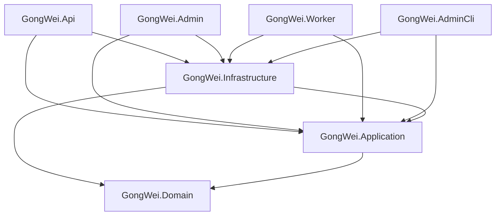

# 宮闈浮生後端從零建置規格 v1.1

> 狀態：後端工程開工指令
> 前提：目前沒有可沿用的 `GongWei.Api`、`GongWei.Admin`、`GongWei.Worker`；開發者必須自行建立
> Target：.NET 10 LTS／ASP.NET Core 10、PostgreSQL 17 或 18、IIS、Windows Service

## 1. 完成定義

本文件不是假設三個專案已存在，而是要求後端開發者從空白 Repository 建立完整 Solution。第一個里程碑不是完成全部 234 支 API，而是：

1. `GongWei.Api`、`GongWei.Admin`、`GongWei.Worker`、共用層、`GongWei.AdminCli` 與測試專案全部建立。
2. `dotnet restore`、`dotnet build --no-restore --warnaserror`、`dotnet test --no-build` 全部成功。
3. PostgreSQL 可從空白資料庫依序套用 Schema、管理員 Bootstrap、Rules Seed、NPC Seed。
4. LINE Login 已使用 `line_login_attempts`，可抵抗 App Pool 回收與 State 重放。
5. 任一能力／銀兩異動能以單一交易更新 Result、Ledger、Stats、Chronicle、Progress、Audit 與 Outbox。

不得為了讓編譯通過而建立回傳固定資料的 234 個空 Controller、使用 InMemory DB 代替 PostgreSQL、略過安全驗證，或把待辦藏在 `catch {}`。

## 2. Repository 結構

```text
GongWeiFuSheng.Backend/
├─ GongWeiFuSheng.slnx
├─ global.json
├─ Directory.Build.props
├─ Directory.Packages.props
├─ .editorconfig
├─ src/
│  ├─ GongWei.Api/
│  ├─ GongWei.Admin/
│  ├─ GongWei.Worker/
│  ├─ GongWei.Application/
│  ├─ GongWei.Domain/
│  └─ GongWei.Infrastructure/
├─ tools/
│  └─ GongWei.AdminCli/
├─ tests/
│  ├─ GongWei.Domain.Tests/
│  ├─ GongWei.Application.Tests/
│  ├─ GongWei.Api.Tests/
│  ├─ GongWei.Postgres.Tests/
│  └─ GongWei.Architecture.Tests/
├─ db/
│  └─ authoritative/
│     └─ v1.1/
│        ├─ schema_v1.1.sql
│        ├─ seed_rules_v1.1.sql
│        └─ seed_npcs_v1.1.sql
└─ deploy/
   ├─ iis/
   ├─ worker/
   └─ database/
```

`backend-spec/` 是規格交付來源；後端 Repository 的 `db/authoritative/v1.1/` 必須保留上述三份 SQL 原檔。Setup 腳本若缺任一份檔案必須失敗，不得再用「警告後跳過」掩蓋不完整交付。

## 3. 從空白建立 Solution

下列指令以 PowerShell 及已安裝的 .NET 10 SDK 執行。`.NET 10` 的 `dotnet new sln` 預設產生 `.slnx`；所有 Package 版本用 Central Package Management 固定，不得使用 `*` 浮動版本。

```powershell
$backendRoot = 'C:\src\GongWeiFuSheng.Backend'
New-Item -ItemType Directory -Path $backendRoot
Set-Location $backendRoot

$sdkVersion = dotnet --version
if (-not $sdkVersion.StartsWith('10.')) { throw '.NET 10 SDK is required.' }

dotnet new globaljson --sdk-version $sdkVersion --roll-forward latestPatch
dotnet new sln --name GongWeiFuSheng
dotnet new editorconfig
dotnet new packagesprops

dotnet new webapi  --name GongWei.Api            --output src/GongWei.Api            --framework net10.0 --use-controllers
dotnet new mvc     --name GongWei.Admin          --output src/GongWei.Admin          --framework net10.0 --auth None
dotnet new worker  --name GongWei.Worker         --output src/GongWei.Worker         --framework net10.0
dotnet new classlib --name GongWei.Application   --output src/GongWei.Application    --framework net10.0
dotnet new classlib --name GongWei.Domain        --output src/GongWei.Domain         --framework net10.0
dotnet new classlib --name GongWei.Infrastructure --output src/GongWei.Infrastructure --framework net10.0
dotnet new console --name GongWei.AdminCli       --output tools/GongWei.AdminCli     --framework net10.0

dotnet new xunit --name GongWei.Domain.Tests       --output tests/GongWei.Domain.Tests       --framework net10.0
dotnet new xunit --name GongWei.Application.Tests  --output tests/GongWei.Application.Tests  --framework net10.0
dotnet new xunit --name GongWei.Api.Tests          --output tests/GongWei.Api.Tests          --framework net10.0
dotnet new xunit --name GongWei.Postgres.Tests     --output tests/GongWei.Postgres.Tests     --framework net10.0
dotnet new xunit --name GongWei.Architecture.Tests --output tests/GongWei.Architecture.Tests --framework net10.0

dotnet sln add (Get-ChildItem -Recurse -Filter *.csproj | ForEach-Object FullName)
```

實際 Repository 路徑可不同，但專案名稱、用途與相依方向不得任意合併。

## 4. 專案相依方向



建立 Project Reference：

```powershell
dotnet add src/GongWei.Application reference src/GongWei.Domain
dotnet add src/GongWei.Infrastructure reference src/GongWei.Application src/GongWei.Domain

dotnet add src/GongWei.Api reference src/GongWei.Application src/GongWei.Infrastructure
dotnet add src/GongWei.Admin reference src/GongWei.Application src/GongWei.Infrastructure
dotnet add src/GongWei.Worker reference src/GongWei.Application src/GongWei.Infrastructure
dotnet add tools/GongWei.AdminCli reference src/GongWei.Application src/GongWei.Infrastructure

dotnet add tests/GongWei.Domain.Tests reference src/GongWei.Domain
dotnet add tests/GongWei.Application.Tests reference src/GongWei.Application src/GongWei.Domain
dotnet add tests/GongWei.Api.Tests reference src/GongWei.Api
dotnet add tests/GongWei.Postgres.Tests reference src/GongWei.Infrastructure
dotnet add tests/GongWei.Architecture.Tests reference src/GongWei.Domain src/GongWei.Application src/GongWei.Infrastructure src/GongWei.Api src/GongWei.Admin src/GongWei.Worker
```

禁止反向參考：Domain 不認識 Application／Infrastructure／Host；Application 不參考 Infrastructure；Admin 不用 Loopback HTTP 呼叫 Api。

## 5. 套件基線

開發者先查 NuGet 與 .NET 10 相容的穩定版，再將精確版本寫入 `Directory.Packages.props`。Package Reference 本身不寫 Version。最低需要：

| Project | Package／能力 |
|---|---|
| Infrastructure | `Microsoft.EntityFrameworkCore`、`Microsoft.EntityFrameworkCore.Design`、`Npgsql.EntityFrameworkCore.PostgreSQL`、Npgsql、Data Protection、HttpClientFactory |
| Api | `Microsoft.AspNetCore.OpenApi`、Health Checks、Rate Limiting；OpenAPI UI 可選但 Production 預設關閉 |
| Admin | ASP.NET Core MVC／Razor、AntiForgery、Cookie Authentication |
| Worker | `Microsoft.Extensions.Hosting.WindowsServices`，以 Windows Service 執行 |
| AdminCli | Generic Host、Configuration、Logging；不得啟動 Web Server |
| Tests | xUnit、ASP.NET Core `WebApplicationFactory`、PostgreSQL Testcontainers、Architecture Test 套件 |

`Microsoft.EntityFrameworkCore.Design` 設 `PrivateAssets=all`。不得加入 EF InMemory Provider 作為資料庫整合測試替代品。

`Directory.Build.props` 至少啟用：

```xml
<Project>
  <PropertyGroup>
    <TargetFramework>net10.0</TargetFramework>
    <Nullable>enable</Nullable>
    <ImplicitUsings>enable</ImplicitUsings>
    <TreatWarningsAsErrors>true</TreatWarningsAsErrors>
    <AnalysisLevel>latest-recommended</AnalysisLevel>
    <InvariantGlobalization>false</InvariantGlobalization>
    <RestorePackagesWithLockFile>true</RestorePackagesWithLockFile>
  </PropertyGroup>
</Project>
```

## 6. Host 責任

### 6.1 `GongWei.Api`

- 玩家 JSON API，Base Path `/api/v1`。
- LINE Login、Opaque Cookie Session、CSRF、CORS、Rate Limit、Problem Details、OpenAPI、Request ID。
- Controller／Endpoint 只做 HTTP Mapping；所有規則呼叫 Application Command／Query。
- 第一批只做 Health、Meta、Auth、Me 與一條完整角色查詢 Vertical Slice；234 支端點按 `api_v1_v1.1.md` 逐批完成，不建立假 Stub。

### 6.2 `GongWei.Admin`

- IIS 上獨立站台 `gongwei-admin.miglow.vip`，ASP.NET Core MVC／Razor Pages。
- 使用獨立 Admin Session Cookie、AntiForgery 與資料庫 RBAC。
- 直接呼叫 Application Use Case，不透過 HTTP 呼叫 `GongWei.Api`。
- 第一批頁面：登入狀態、管理員名單、角色申請查詢、Audit 查詢、NPC 查詢。

### 6.3 `GongWei.Worker`

- Worker Service，發布後安裝為 Windows Service，不依賴 IIS App Pool 常駐。
- 負責 Outbox、宮廷日曆、俸祿、事件截止、妊娠／出生、Session／Login Attempt 清理。
- 每個 Job 使用 PostgreSQL Advisory Lock 或等價單例鎖；具 Idempotency 與執行紀錄。

### 6.4 `GongWei.AdminCli`

- 僅供伺服器本機維運，不開 HTTP Port。
- v1.1 必做命令：`grant-super-admin`、`verify-database`、`show-migration-status`。
- CLI 共用 Application／Infrastructure，不直接拼 SQL。

## 7. 資料庫初始化順序

正式順序固定如下：

```text
1. 套用 schema_v1.1.sql／等價 Initial EF Migration
2. 啟動 API
3. 站長以 LINE Login 登入一次，建立 game.users
4. 停止或維持維護模式
5. AdminCli grant-super-admin
6. 執行 seed_rules_v1.1.sql
7. 執行 seed_npcs_v1.1.sql
8. AdminCli verify-database
9. 啟動 Api/Admin/Worker 並跑 Smoke Test
```

Setup 必須檢查三份 SQL 均存在並核對部署包 Manifest／Hash；缺檔直接非零結束。Seed 失敗必須 Rollback 並中止部署。

## 8. 待辦 #20：LINE Login Attempt 完整實作

### 8.1 必做元件

- EF Entity／Mapping：`LineLoginAttempt` 對應 `game.line_login_attempts`。
- `IReturnUrlPolicy`：只允許 `https://miglow.vip/gongwei/` 範圍。
- `ILineLoginAttemptStore.CreateAsync` 與原子 `ConsumeAsync`。
- `ILineLoginClient`：Authorize URI、Token Exchange、Verify ID Token。
- Data Protection Protector：保存 Nonce、PKCE Verifier、Return URL；資料庫只存 State／Nonce Hash。
- `GET /api/v1/auth/line/start` 與 Callback。
- Worker 清除過期 Attempt。

### 8.2 Start 交易

1. 驗證 Return URL。
2. 產生 256-bit State、256-bit Nonce 與 PKCE S256。
3. 寫入 State Hash、Nonce Hash、Protected Payload、Return URL、10 分鐘 Expiry。
4. Commit 後才 302 到 LINE。

### 8.3 Callback 交易

1. State Hash 查詢 Attempt，使用 Row Lock／條件更新一次性標記 `consumed_at`。
2. 不存在、過期或已消耗都不得 Token Exchange。
3. 使用 PKCE Verifier 交換 Token，透過 LINE Verify ID Token 驗證 Client ID、Issuer、Expiry、Nonce、Sub。
4. 同交易 Upsert User、建立 Session、撤銷超額舊 Session、寫 Audit。
5. 不保存 LINE Access／Refresh Token；不把 Code、State、Nonce、Secret、完整 LINE Sub 寫 Log。

### 8.4 驗收

- App Pool 在 Start 與 Callback 中間回收，登入仍成功。
- 同一 State 兩個並行 Callback，只有一個可成功。
- 外站／編碼繞過 Return URL 全部被拒絕。
- LINE Endpoint 失敗不留下半成品 Session。

完整規則以 `line_login_v1.1.md` 為準。

## 9. 待辦 #21：首次 Super Admin CLI

命令：

```powershell
dotnet GongWei.AdminCli.dll grant-super-admin `
  --line-user-id '<LINE_SUB>' `
  --reason 'initial production bootstrap'
```

實作要求：

1. 只接受已存在於 `game.users` 的 LINE Sub；找不到直接失敗。
2. 顯示遮罩後帳號與 User ID，要求輸入完整確認詞；CI 非互動模式必須另有受控 `--confirm`，且記錄部署身分。
3. 同一交易 Upsert `admin_role_assignments(super_admin)` 並新增 `audit_logs`。
4. 已存在且有效時回成功的 Idempotent 結果，不建立重複紀錄。
5. 不輸出完整 LINE Sub、Connection String 或 Secret。
6. Exit Code：0 成功／已存在；2 參數錯誤；3 使用者不存在；4 DB／交易失敗；5 未確認。

`verify-database` 至少檢查 Active Super Admin、Rules Settings、60 張 Table、28 個能力標籤、8 個地點、8 位已發布 NPC、必要 Index／Trigger 與 Migration ID。

## 10. 待辦 #22：Character Mutation Pipeline

所有會改變玩家能力、銀兩、道具、位階或公開狀態的 Use Case 必須走統一交易協調器，例如：

```csharp
public interface ICharacterMutationPipeline
{
    Task<CharacterMutationResult> ExecuteAsync(
        CharacterMutationCommand command,
        CancellationToken cancellationToken);
}
```

單一 PostgreSQL Transaction 內依序：

1. 驗證 Idempotency Key、角色狀態、規則版本與資源 Version。
2. 鎖定 Character Stats／Wallet／Inventory 的必要資料列。
3. 寫業務結果，例如 Event Result、Purchase 或 Adjustment。
4. 銀兩異動寫不可變 `ledger_entries`；能力異動更新 `character_stats`。
5. 道具異動更新 Inventory 並寫 Movement。
6. 寫玩家可讀的 `character_chronicle_entries`，包含 Before／Delta／After 與 Visibility。
7. 依事件結算、投稿字數等更新 `character_progress` Projection；普通銀兩調整不得誤加事件計數。
8. 管理或敏感異動寫 `audit_logs`，理由必填；玩家系統異動至少保留 Actor／Source／Request ID。
9. 寫 `outbox_messages`；Transaction 外由 Worker 發送通知。
10. Commit 後回 DTO；重試相同 Idempotency Key 回相同結果，不重複加值。

禁止 Repository 各自 `SaveChangesAsync`。Application Handler 每個命令只能由一個 Unit of Work Commit；任何一步失敗必須全數 Rollback。

最低整合測試：

- 事件 `vitality +10`：Result、Stats、Chronicle、Progress、Audit／Outbox 同時存在。
- 購買 `silver -100`：Ledger、Wallet、Inventory、Chronicle、Outbox 一致，Progress 事件數不變。
- 管理調整：必填理由，Audit 可由管理網頁查到。
- 並行重試：相同 Idempotency Key 只結算一次。
- 中途注入例外：所有表均無半套資料。

## 11. 建置與 CI Gate

開發者每一批提交必須通過：

首次建立專案時先執行一次 `dotnet restore GongWeiFuSheng.slnx` 產生各專案的 `packages.lock.json` 並提交；CI 與後續部署才使用 Locked Mode：

```powershell
dotnet restore GongWeiFuSheng.slnx --locked-mode
dotnet build GongWeiFuSheng.slnx --no-restore --configuration Release --warnaserror
dotnet test GongWeiFuSheng.slnx --no-build --configuration Release
dotnet format GongWeiFuSheng.slnx --verify-no-changes
```

CI 另需：

- PostgreSQL 17／18 Testcontainer 從空白套用 Initial Migration。
- 比對 Migration 與 `schema_v1.1.sql` 的 Table、FK、Index、Check、Trigger 語意。
- 依正式順序執行 Bootstrap／兩份 Seed，第二次重跑保持 Idempotent。
- API OpenAPI Snapshot 與 `api_v1_v1.1.md` 已實作範圍對齊。
- Architecture Test 阻擋錯誤 Project Reference。
- Secret Scan、Dependency Audit、SQL／C# 靜態分析。

## 12. 實作批次

### Batch A：必須先完成

- 建立 Solution／Projects／References／CPM／CI。
- Schema／DbContext／Migration／Health。
- #20 LINE Login Attempt。
- #21 AdminCli Bootstrap。
- Auth Session、CSRF、CORS、RBAC、`GET /me`。
- #22 Mutation Pipeline 基礎及兩個完整整合測試。

### Batch B：第一個可玩 Vertical Slice

- 建角 Draft／Submit／Admin Review。
- 核准後建立 Character／Stats／Wallet／Progress／Chronicle。
- 人物頁、能力標籤、今日／歷史 Chronicle。
- NPC Published List／Detail 與 Admin NPC CMS。

### Batch C 之後

- 依 `api_v1_v1.1.md` P0→P1→P2 完成事件、經濟、宮市、庫存、生育、死亡與營運端點。
- 每批都必須保持 Solution 可建置，不接受「等 234 支全部寫完再修 Build」。

## 13. 參考

- [完整後端規格](../後端規格書_v1.1.md)
- [API Contract](./api_v1_v1.1.md)
- [LINE Login](./line_login_v1.1.md)
- [PostgreSQL Schema](./schema_v1.1.sql)
- [規則 Seed](./seed_rules_v1.1.sql)
- [NPC Seed](./seed_npcs_v1.1.sql)
- [Microsoft：dotnet sln](https://learn.microsoft.com/en-us/dotnet/core/tools/dotnet-sln)
- [Microsoft：.NET Default Templates](https://learn.microsoft.com/en-us/dotnet/core/tools/dotnet-new-sdk-templates)
- [Microsoft：Worker as Windows Service](https://learn.microsoft.com/en-us/aspnet/core/host-and-deploy/windows-service?view=aspnetcore-10.0)
- [Microsoft：ASP.NET Core on IIS](https://learn.microsoft.com/en-us/aspnet/core/tutorials/publish-to-iis?view=aspnetcore-10.0)
- [Microsoft：NuGet Central Package Management](https://learn.microsoft.com/en-us/nuget/consume-packages/central-package-management)
