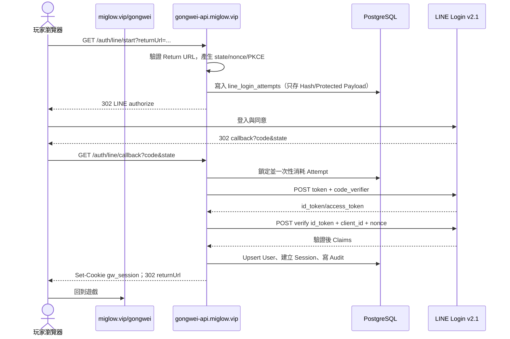

# 宮闈浮生 LINE Login 與 Web Session 規格 v1.1

> 定稿日期：2026-08-16  
> LINE Login Channel：宮闈浮生（Channel ID `2011123657`）  
> Protocol：OAuth 2.0 Authorization Code + OpenID Connect v2.1 + PKCE S256
> Console 狀態：正式 Callback 已登錄；Channel 暫維持 `Developing`

## 1. 固定網址與 Console 設定

| 項目 | 正式值 |
|---|---|
| 玩家前台 | `https://miglow.vip/gongwei/` |
| API Base | `https://gongwei-api.miglow.vip/api/v1` |
| Callback URL | `https://gongwei-api.miglow.vip/api/v1/auth/line/callback` |
| LINE Authorize | `https://access.line.me/oauth2/v2.1/authorize` |
| LINE Token | `https://api.line.me/oauth2/v2.1/token` |
| LINE Verify ID Token | `https://api.line.me/oauth2/v2.1/verify` |
| Scope | `openid profile`；目前不要求 Email |
| Production CORS Origin | `https://miglow.vip`；Origin 不含 `/gongwei/` |

LINE Console 已將正式 Callback 精確加入 Callback URL。測試網址要逐筆加入，不得用萬用字元。Channel 在 Developing 時只允許 Admin／Tester；公開測試前切換 Published。Channel Secret 只由 IIS Secret Store 或受控環境變數提供。

## 2. 登入時序



## 3. `GET /auth/line/start`

### 3.1 輸入

- `returnUrl` 必填，解碼一次後必須符合 Scheme=`https`、Host=`miglow.vip`、Port=443 或省略、Path 等於 `/gongwei/` 或以 `/gongwei/` 開頭。
- 拒絕 UserInfo、反斜線、Control Character、Scheme-relative URL、非預設 Port，以及二次解碼後 Host／Path 會改變的值。
- Hash Route 可以保留，例如 `https://miglow.vip/gongwei/#/home`；Server 驗證 Origin／Path 後才封裝完整回跳值。

### 3.2 產生值

- `state`：至少 256-bit CSPRNG，Base64Url；資料庫只存 SHA-256 Hash。
- `nonce`：至少 256-bit CSPRNG，Base64Url；資料庫只存 SHA-256 Hash。
- `code_verifier`：43–128 字元高熵 Base64Url；`code_challenge = BASE64URL(SHA256(verifier))`。
- `protected_payload`：以 ASP.NET Core Data Protection 保護 `nonce`、`code_verifier`、Return URL 與建立時間；Purpose 固定含版本，例如 `GongWei.LineLogin.Attempt.v1`。
- Attempt 有效 10 分鐘；同 IP 每分鐘 20 次、同 User-Agent/IP 組合每 10 分鐘 40 次，超過回 `429 AUTH_RATE_LIMITED`。

### 3.3 Redirect

送至 LINE Authorize Endpoint：

```text
response_type=code
client_id=2011123657
redirect_uri=https://gongwei-api.miglow.vip/api/v1/auth/line/callback
state=<random>
scope=openid profile
nonce=<random>
code_challenge=<S256 challenge>
code_challenge_method=S256
```

所有參數必須分別 URL Encode。不得把 Channel Secret、PKCE Verifier 或 Session Token放進 URL。

## 4. `GET /auth/line/callback`

### 4.1 Attempt 驗證與一次性消耗

1. 若 LINE 回傳 `error`，以一般化錯誤碼記錄 Failure，消耗 Attempt，導回 `/#/login-error?code=LINE_ACCESS_DENIED`。
2. 對收到的 `state` 計算 SHA-256，以 `SELECT ... FOR UPDATE` 找未消耗且未過期 Attempt。
3. 查不到回 `AUTH_STATE_INVALID`；已消耗回 `AUTH_STATE_REPLAYED`；過期回 `AUTH_STATE_EXPIRED`。
4. 在同一交易先設定 `consumed_at`。後續 Token／OIDC 失敗只更新 `failure_code`，不得讓同一 State 再試。
5. 解開 Protected Payload；解密錯誤回 `AUTH_ATTEMPT_UNPROTECT_FAILED` 並告警，錯誤內容不可顯示 Key Material。

### 4.2 Token 交換

後端以 `application/x-www-form-urlencoded` POST Token Endpoint：

- `grant_type=authorization_code`
- `code`
- `redirect_uri`，必須與 Authorize 完全相同
- `client_id=2011123657`
- `client_secret=<secret>`
- `code_verifier=<protected payload>`

HttpClient Timeout 10 秒；只對網路錯誤或 5xx 做最多 1 次短退避重試。Authorization Code 類 4xx 不重試。Response Body、Code、ID Token、Access Token 不可寫入 Log。

### 4.3 ID Token 驗證

v1.1 採 LINE Verify ID Token Endpoint，由後端送 `id_token`、`client_id=2011123657`、原始 `nonce`。必須驗證回應：

- `iss` 是 LINE 官方 Issuer。
- `aud`／Client ID 是 `2011123657`。
- `exp` 未過期，`iat` 合理；伺服器時鐘以 NTP 同步，允許 Clock Skew 最多 60 秒。
- 回傳 `nonce` 與 Attempt 中原始 Nonce Constant-time 相等。
- `sub` 非空且長度合法；只把 `sub` 當作 LINE 使用者唯一識別，顯示名稱不可當 Key。

若未來改為本機 JWT 驗證，需另經 Security Review，嚴格固定官方演算法、Issuer、Audience、Lifetime、Nonce 與簽章驗證；不得只 Decode Payload。

### 4.4 User 與 Session

在一個 DB Transaction 中：

1. 以 `users.line_user_id = sub` Upsert 使用者，更新 LINE 顯示名稱、頭像與 `last_login_at/last_seen_at`；不可覆寫遊戲角色名。
2. `status=suspended` 不建立 Session，回 `AUTH_ACCOUNT_SUSPENDED`；`deleted` 依保留政策不得自動復活。
3. 建立 256-bit Opaque Session Token；資料庫只存 `SHA-256(token + server_pepper)`。
4. 建立獨立 CSRF Secret，資料庫只存 Hash；同帳號最多保留 5 個有效 Session，超出時撤銷最舊 Session。
5. 寫入登入 Audit，內容只含 User ID、結果、Request ID、經遮罩的 IP／User-Agent 摘要，不含 Token 或完整 LINE Sub。
6. Commit 後設定 Cookie 並 `303` 導回已驗證 Return URL。

LINE Access Token 與 Refresh Token 在完成驗證後立即丟棄，不存 DB、Cache、Cookie 或 Log。

## 5. Cookie Session、CSRF 與 CORS

### 5.1 玩家 Session Cookie

```text
gw_session=<opaque token>; Secure; HttpOnly; SameSite=Lax; Path=/
```

- 使用 Host-only Cookie，不設定 `Domain=.miglow.vip`。
- Idle 7 天、Absolute 30 天；每次有效請求最多每 5 分鐘更新一次 `last_seen_at` 與 Idle Expiry，避免每個靜態請求寫 DB。
- Logout、停權、死亡不等於刪除 Session；Logout 撤銷目前 Session，停權撤銷全部 Session。死亡角色仍可登入並重新申請。
- Cookie 值不得出現在 Application Insights／IIS Log；Proxy 必須遮罩 `Cookie`、`Set-Cookie`、`Authorization`。

### 5.2 CSRF

- `GET /auth/csrf` 在有效 Session 下回傳短效、Session-bound CSRF Token。
- 所有 `POST/PUT/PATCH/DELETE` 必須同時符合 Session Cookie、允許 Origin、`X-CSRF-Token`；失敗回 `403 CSRF_INVALID`。
- Admin Web 使用獨立 `gw_admin_session` 與 ASP.NET Core AntiForgery，不共用玩家 CSRF Token。

### 5.3 CORS

Production API 只允許：

```csharp
policy.WithOrigins("https://miglow.vip")
      .WithMethods("GET", "POST", "PUT", "PATCH", "DELETE", "OPTIONS")
      .WithHeaders("Content-Type", "X-CSRF-Token", "Idempotency-Key", "If-Match")
      .AllowCredentials();
```

不得把 `AllowAnyOrigin()` 與 `AllowCredentials()` 併用。`https://www.miglow.vip` 目前只負責 301 到 Apex，不在正式寫入 Allowlist。Local／Staging Origin 用環境設定逐一列出，不得用字尾比對接受攻擊者子網域。

## 6. 登入相關 API

| Method + Path | Auth | 說明 |
|---|---|---|
| `GET /auth/line/start` | Anonymous | 建立 Attempt 並 302 至 LINE |
| `GET /auth/line/callback` | Anonymous | 驗證 LINE、建立 Session、303 回前端 |
| `GET /auth/session` | User | 回目前登入者、角色摘要、權限與到期時間 |
| `GET /auth/csrf` | User | 取得 Session-bound CSRF Token |
| `POST /auth/logout` | User + CSRF | 撤銷目前 Session並清 Cookie |
| `POST /auth/logout-all` | User + CSRF | 撤銷此帳號全部 Session |

登入錯誤以穩定代碼回前端；詳細原因只在結構化安全 Log：

| Code | HTTP／導回 | 玩家訊息 |
|---|---|---|
| `LINE_ACCESS_DENIED` | 303 | 已取消 LINE 登入 |
| `AUTH_STATE_INVALID` | 400／303 | 登入連結無效，請重新登入 |
| `AUTH_STATE_EXPIRED` | 400／303 | 登入已逾時，請重新登入 |
| `AUTH_STATE_REPLAYED` | 400／303 | 登入連結已使用 |
| `AUTH_LINE_TOKEN_FAILED` | 502／303 | LINE 登入暫時失敗 |
| `AUTH_ID_TOKEN_INVALID` | 401／303 | 無法驗證登入身分 |
| `AUTH_ACCOUNT_SUSPENDED` | 403／303 | 帳號目前停權 |
| `AUTH_RATE_LIMITED` | 429 | 嘗試過於頻繁，請稍後再試 |

Callback 導回 URL 只帶穩定錯誤碼，不帶 LINE 原始 Error Description、Exception、SQL、Token 或 PII。

## 7. 類別與責任切分

```text
GongWei.Api
  AuthEndpoints / SessionMiddleware / CsrfMiddleware
GongWei.Application
  StartLineLoginCommand / CompleteLineLoginCommand / LogoutCommand
GongWei.Infrastructure
  LineLoginClient / LoginAttemptStore / OpaqueSessionStore / DataProtectionPayloadProtector
GongWei.Domain
  LoginAttemptPolicy / ReturnUrlPolicy / UserStatusPolicy
```

建議介面：

```csharp
public interface ILineLoginClient
{
    Uri BuildAuthorizeUri(LineAuthorizeRequest request);
    Task<LineTokenResponse> ExchangeCodeAsync(LineCodeExchange request, CancellationToken ct);
    Task<VerifiedLineIdentity> VerifyIdTokenAsync(string idToken, string nonce, CancellationToken ct);
}

public interface ILoginAttemptStore
{
    Task CreateAsync(LoginAttempt attempt, CancellationToken ct);
    Task<ConsumedLoginAttempt> ConsumeAsync(byte[] stateHash, DateTimeOffset now, CancellationToken ct);
}
```

`ConsumeAsync` 必須以資料庫鎖與條件更新保證一次性，不可先讀後寫。

## 8. 清理、監控與告警

- Worker 每 15 分鐘刪除已過期 24 小時以上的 `line_login_attempts`；Audit 永久保留。
- 指標：Start、Callback Success、User Denied、State Invalid／Replay、Token Failure、ID Token Failure、Session Created、Latency。
- 同 IP／ASN 大量 State Invalid、Nonce Invalid、重放或登入尖峰觸發告警。
- `/health/ready` 只確認 DB、Data Protection Key Ring 及必要設定可用；不可實際呼叫 LINE 或顯示 Secret。
- LINE 暫時不可用時回可重試的友善頁，不建立半成品 User／Session。

## 9. 最低測試矩陣

- 正常登入：新使用者、既有使用者、沒有角色、已有存活角色、角色已死亡。
- State：缺少、錯誤、過期、同時雙 Callback、已消耗重放。
- OIDC：Nonce／Audience／Issuer／Expiry 不符、缺 `sub`、LINE Endpoint Timeout。
- Return URL：外站、`//evil`、UserInfo、Unicode／Percent Encoding、雙重 Encoding、非 443 Port、合法 Hash Route。
- Session：Cookie Flag、Idle／Absolute Expiry、最多 5 組、Logout、Logout All、停權撤銷。
- CSRF／CORS：缺 Header、錯 Token、錯 Origin、`www` Origin、OPTIONS Preflight、合法 `miglow.vip`。
- 隱私：所有 Log、Problem Details、OpenAPI 與 Audit 均沒有 Secret、Token、Authorization Code、Nonce、完整 State 或完整 LINE Sub。

## 10. 官方參考

- [LINE Login：Integrating LINE Login with your web app](https://developers.line.biz/en/docs/line-login/integrate-line-login/)
- [LINE Login API reference](https://developers.line.biz/en/reference/line-login/)
- [Verify ID tokens](https://developers.line.biz/en/docs/line-login/verify-id-token/)
- [LINE Login security checklist](https://developers.line.biz/en/docs/line-login/security-checklist/)
- [Secure login process](https://developers.line.biz/en/docs/line-login/secure-login-process/)
- [ASP.NET Core CORS](https://learn.microsoft.com/en-us/aspnet/core/security/cors?view=aspnetcore-10.0)
